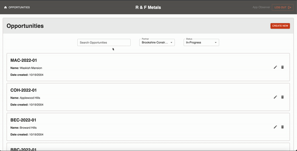

# **R & F Metals | Sales Application**

*Project Duration: 2 Week Sprint*

This client project is a professional sales platform designed and developed for R & F Metals, a steel fabrication company located in Clinton, MD. Their sales team can use this application for managing their leads and creating proposals as projects arise. The smooth, easy-to-use workflow of the platform allows its users to easily create, update, and delete information within their network, as well as produce and generate PDF proposals to provide to their clients. 

### **What problem was solved?**

Our application eliminated the need for the company's sales team to reference several different files to manage their clientele and generate proposal quotes. It also implemented R & F's unique, complex pricing structure for calculating the price of its offered products and materials. Users can simply focus on generating sales for the company.

Live Version deployed on Heroku at: [https://r-f-metals.herokuapp.com/#/home](https://r-f-metals.herokuapp.com/#/home)

## **Wireframe**

;

## **Prerequisites**

Before getting started launching this application, you should have the following software installed on your computer:

- [Node.js](https://nodejs.org/en/)
- [PostrgeSQL](https://www.postgresql.org/)
- [Nodemon](https://nodemon.io/)

## **Database Setup**

Make a new database called `r_f_metals` in PostgreSQL and use the **database.sql** file provided in the root of this project to set up all of your tables. Simply copy the code from the database.sql file and execute the selection once its pasted in the SQL Query view.

## **Creating the .ENV**

* Create a `.env` file at the root of the project. This file will require several pieces of information that will each need to acquired separately. Further instructions on obtaining these keys are provided below:

    ```
    SERVER_SESSION_SECRET=*******************
    API_KEY=********************
    ```

First you will need to establish a **SERVER_SESSION_SECRET** to keep your application secure. Here's a site that can help you generate a secret: [https://passwordsgenerator.net/](https://passwordsgenerator.net/).  **NOTE** This secret should be more than 8 characters.  Having a secret key that is less than 8 characters or leaving it as "superDuperSecret" will result in a warning from the app.

## **Installation**

1. Run `npm install`
2. Start Postgres using `brew services start postgresql`
    - only required if PG is not already running
3. Run `npm run server`
4. Run `npm run client`
5. Navigate to `localhost:3000`

## **How to Use the Application**

### **Functionality**
There are `CREATE NEW` buttons located throughout the application. This allows users to create new Opportunities, Proposals, Headings, and more. 

Entities can be edited and deleted by clicking on the `PENCIL` and `TRASHCAN` icons. Both buttons will prompt the user to a view where information can be updated or archived. 

Most views include a `SAVE PROGRESS` button, which is necessary for users to click on when anything on the page has been updated. 

Users can navigate between views by clicking on tabs associated with the view they are on. For example, the Proposal view includes tabs for general information, headings, and the PDF preview.

### **Access Levels**
There are two access levels to this application:

**Admins & Sales Managers:**
- Admins and Sales Managers have the ability to view all opportunities and proposals that exist across the entire platform. They are also allowed to create new users and edit the status of existing users (ex: change status from saleperson to sales manager).

**Salespeople:**
- Salespeople are able to view everything that's connected to them as a user. They do not have access to other opportunities assigned to the rest of the sales team.

## **Built With**

This application uses the following technologies:

- JavaScript
- React
- Redux
- Sagas
- HTML 5
- CSS 3
- Node
- Express
- Passport
- PostgreSQL
- Material-UI
- ZipAPI

## **Acknowledgements**

We are extremely thankful to R & F Metals for allowing us to be involved in solving one of their businesses major needs. More specifically, we would like to thank Lee, Flynn, and Andy for the roles they played in bringing this project to life. 

We couldn't have planned, designed, developed, and presented on this application without the curriculum and support provided by Prime Digital Academy. Our instructor, Liz Kerber, played an instrumental role in teaching us the necessary skills to become exceptional software engineers. 

And lastly, thank you to our classmates, family, and friends, for their ongoing support and encouragement throughout the duration of this project.

## **Support**

The developers of this application would love to connect with you if you have any questions regarding this project or feedback on how to improve its functionality. Their contact information can be found below:
- [Dan Fenske](https://github.com/danielfenske) -- dlfenske.fenske@gmail.com
- [Cameron Soudbash](https://github.com/csoudbash) -- csoudbash@gmail.com
- [David Meuer](https://github.com/Davey-M) -- davey.meuer+res@gmail.com
- [Heather Kim](https://github.com/heather-h-kim) -- heatherkim0405@gmail.com
- [Mark Terry](https://github.com/MarkTerry3) -- markterrydeveloper@gmail.com
